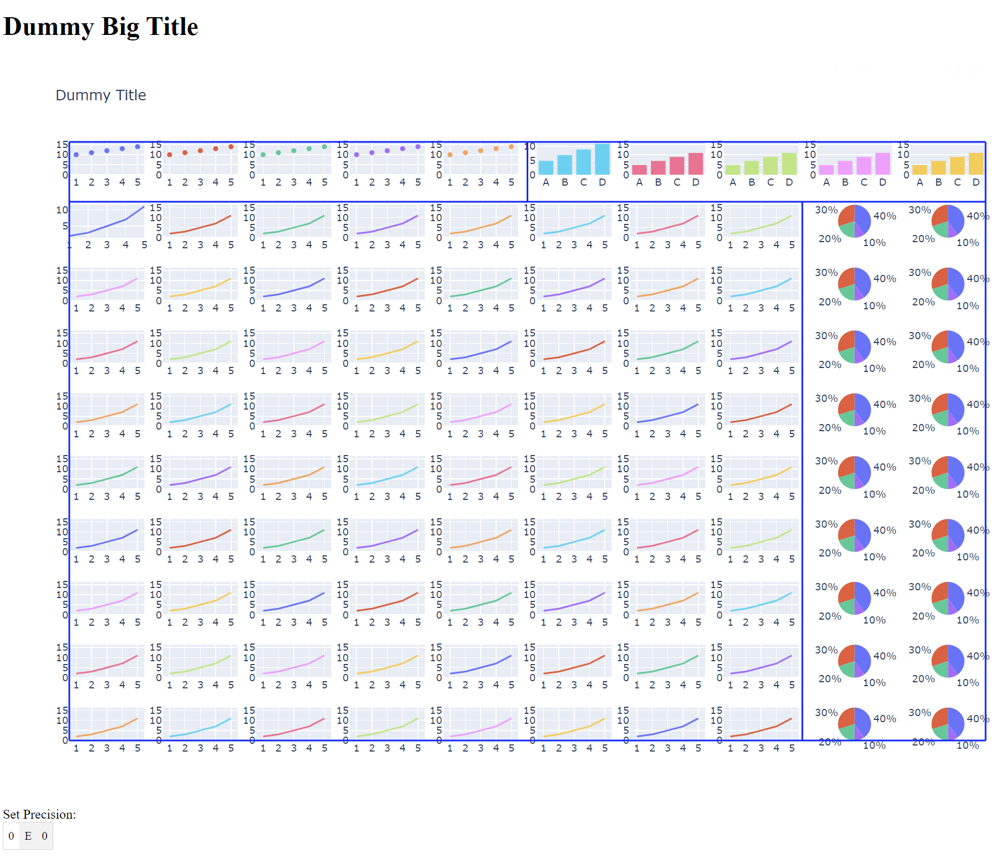

# IndustrialVisualization
IndustrialVisualization

## Description


## Prerequisites

```bash
pip install pandas plotly dash dash_daq
```

## Usage

[Video de uso Visualización de correlaciones en variables de procesos industriales] (https://www.youtube.com/watch?v=1DgIO4Q88YI)

### Render visualization
Run following command from [repo]/src
```bash
python industrialVisualization.py
```
### Visualization



## Authors and acknowledgment
* Brian Morera Madriz (brianjose37@gmail.com)
* Alejandro Arroyo (alearroyov98@GitHub)

## License
[](https://www.gnu.org/licenses/gpl-3.0)
